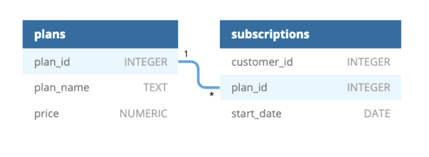

# 🥑 Case Study 3 – Foodie-Fi

 

## 📌 Overview

Foodie-Fi is a fictional subscription-based streaming service focused on food-related content.
Danny launched Foodie-Fi in 2020 and wants to better understand customer behavior, subscription growth, and churn using data-driven insights.

This case study focuses on analyzing subscription journeys, revenue patterns, and customer retention using SQL.

 

## 🗂️ Table Used

Foodie-Fi provides the following tables:

**plans table** :
Details of each subscription plan offered.
| Column Name | Description               |
| ----------- | ------------------------- |
| plan_id     | Unique plan identifier    |
| plan_name   | Name of the plan          |
| price       | Monthly price of the plan |

There are 4 customer plans.
- Basic plan: only available for $9.90 per month, clients have restricted access and can only stream their films.
- Customers may download videos for offline watching and have no time limitations while using the Pro package. Pro options begin at $19.90 per month, with an annual membership costing $199.
- Trial plan: Unless they cancel, downgrade to basic, or upgrade to an annual pro plan at any time during the trial, customers who sign up for the first seven-day free trial will automatically continue with the pro monthly subscription plan.
- Churn plan: Customers will have a churn plan record with a null price when they terminate their Foodie-Fi service, but their plan will remain active until the end of the payment cycle.

**subscriptions table** :
Tracks customer subscriptions over time.
| Column Name | Description                |
| ----------- | -------------------------- |
| customer_id | Unique customer identifier |
| plan_id     | Subscribed plan            |
| start_date  | Subscription start date    |

- The *exact date that a customer's particular plan_id begins* is displayed in their subscriptions.
- The start_date in the subscriptions table will represent the date when the actual plan changes if customers *downgrade* from a pro plan or *cancel their subscription*. The higher plan will be in effect until the time expires.
- Customers will immediately switch to the higher plan when they *upgrade* from a basic plan to a pro or yearly pro plan.
- Customers who *churn* will continue to have access until the end of their current subscription term, but the commencement date will really be the day they made the decision to discontinue their service.

 

## 🧠 Entity Relationship Diagram

 

## ❓Case Study Solutions
- [A. Customer Journey](https://github.com/evanmathew/8-Week-SQL-Challenge/blob/main/Case%20Three%20-%20Foodie-Fi/Customer%20Journey.md)
- [B. Data Analysis Questions](https://github.com/evanmathew/8-Week-SQL-Challenge/blob/main/Case%20Three%20-%20Foodie-Fi/Data%20Analysis%20Questions.md)
- [C. Challenge Payment Question](https://github.com/evanmathew/8-Week-SQL-Challenge/blob/main/Case%20Three%20-%20Foodie-Fi/Challenge%20Payment%20Question.md)
- [D. Outside The Box Questions](https://github.com/evanmathew/8-Week-SQL-Challenge/blob/main/Case%20Three%20-%20Foodie-Fi/Outside%20The%20Box%20Questions.md)

 

## 🔗 Case Study Reference

Original case study by Danny Ma
👉 https://8weeksqlchallenge.com/case-study-3/