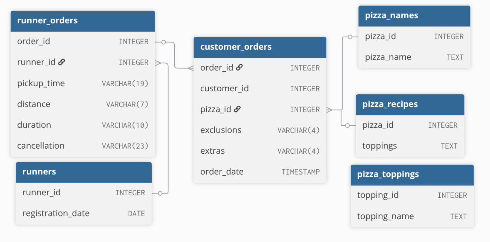

# 🍕 Case Study 2 – Pizza Runner  

 

## 📌 Overview
This case study analyzes the operations of **Pizza Runner**, a pizza delivery service.  
The objective is to use **SQL only** to clean the raw data and answer business questions related to orders, deliveries, runners, and customer behavior.

The dataset contains multiple inconsistencies and data quality issues, making **data cleaning a critical first step** before analysis.

 

## 🗂️ Tables Used

Six key datasets for this case study

- **runners** : The table shows the registration_date for each new runner
- **customer_orders** : Customer pizza orders are captured in the customer_orders table with 1 row for each individual pizza that is part of the order. The pizza_id relates to the type of pizza which was ordered whilst the exclusions are the ingredient_id values which should be removed from the pizza and the extras are the ingredient_id values which need to be added to the pizza.
- **runner_orders** : After each orders are received through the system - they are assigned to a runner - however not all orders are fully completed and can be cancelled by the restaurant or the customer. The pickup_time is the timestamp at which the runner arrives at the Pizza Runner headquarters to pick up the freshly cooked pizzas. The distance and duration fields are related to how far and long the runner had to travel to deliver the order to the respective customer.
- **pizza_names** : Pizza Runner only has 2 pizzas available the Meat Lovers or Vegetarian!
- **pizza_recipes** : Each pizza_id has a standard set of toppings which are used as part of the pizza recipe.
- **pizza_toppings** : The table contains all of the topping_name values with their corresponding topping_id value

 

## Entity Relationship Diagram

 

## 🧹 Data Cleaning
The raw data includes:
- Text values representing missing data (`'null'`, empty strings)
- Mixed data types
- Units embedded within numeric fields
- Comma-separated values stored in single columns

[Check here for Data Cleaning File](https://github.com/evanmathew/8-Week-SQL-Challenge/blob/main/Case%20Two%20-%20Pizza%20Runner/cleaning_data.md)

 

## ❓Case Study Solutions
- [A. Pizza Metrics](https://github.com/evanmathew/8-Week-SQL-Challenge/blob/main/Case%20Two%20-%20Pizza%20Runner/Pizza%20Metric.md)
- [B. Runner and Customer Experience](https://github.com/evanmathew/8-Week-SQL-Challenge/blob/main/Case%20Two%20-%20Pizza%20Runner/Runner%20%26%20Customer%20Experience.md)
- [C. Ingredient Optimisation](https://github.com/evanmathew/8-Week-SQL-Challenge/blob/main/Case%20Two%20-%20Pizza%20Runner/Ingredient%20Optimisation.md)
- [D. Pricing and Ratings]()

 

## 🔗 Case Study Reference

Original case study by Danny Ma
👉 https://8weeksqlchallenge.com/case-study-2/
